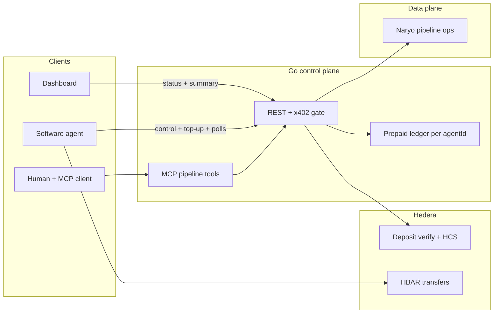

# french-hedera-ethglobal-cannes-2026

Metered control plane for agent-driven data pipelines: humans configure via MCP, agents pay per action with **x402** on the Go API; **Hedera** backs verification, audit, and HBAR flows where it adds value.

## Deployments
Audit topic: https://hashscan.io/testnet/topic/0.0.8511194/messages
Topic for test activity: https://hashscan.io/testnet/topic/0.0.8510924/messages

Agent wallet: https://sepolia.basescan.org/address/0xefd3c8d378aaa06c6c349f704680fc5d7c61a51d#tokentxns
Service wallet (receives payments): https://sepolia.basescan.org/address/0x091f2d318dd6c3c5a92553e7b36009e7e8519e50

USDC: https://sepolia.basescan.org/token/0x036cbd53842c5426634e7929541ec2318f3dcf7e

## Local deployment
Run dashboard:
`cd dashboard && npm i && npm run dev`
http://localhost:3000

(Optional) Run storybook
`cd dashboard && npm i && npm run storybook`
http://localhost:6006

Run API server (.env required)
`set -a && source cmd/api/.env && set +a && go run ./cmd/api`

Start Naryo cluster
`cd deploy/naryo-verify && docker compose up -d`

(Optional) Generate Hedera activity which we will can watch
`cd cmd/hcs-demo-activity && source .env && go run ./main.go -topic 0.0.8510924 -interval 10s`

(Optional) Run demo which subscribes to events watching our topic (.env required)
`cd agents/trading-signal && npm i && npm run demo`

## Architecture (high level)

**How to read it:** Humans configure pipelines through **MCP** into the same **REST** surface agents use; **x402** meters paid actions, backed by the **prepaid ledger**. The API drives **Naryo** (pluggable data plane) and **Hedera** for verify / HCS; agents also use **HBAR** directly for on-chain moves in the demo story. **Dashboard** uses unpaid read APIs for observability.

For triggers, scope, and endpoint detail, see [`docs/PROJECT_SCOPE.md`](docs/PROJECT_SCOPE.md) and [`docs/RUNBOOK.md`](docs/RUNBOOK.md).
