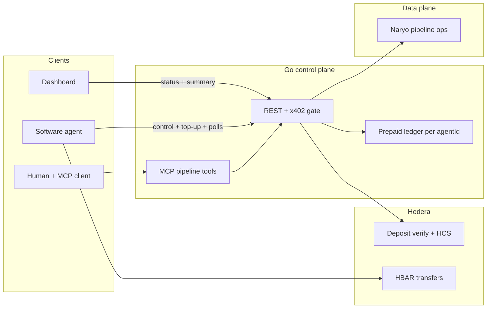

# french-hedera-ethglobal-cannes-2026

Metered control plane for agent-driven data pipelines: humans configure via MCP, agents pay per action with **x402** on the Go API; **Hedera** backs verification, audit, and HBAR flows where it adds value.

## Architecture (high level)

**How to read it:** Humans configure pipelines through **MCP** into the same **REST** surface agents use; **x402** meters paid actions, backed by the **prepaid ledger**. The API drives **Naryo** (pluggable data plane) and **Hedera** for verify / HCS; agents also use **HBAR** directly for on-chain moves in the demo story. **Dashboard** uses unpaid read APIs for observability.

For triggers, scope, and endpoint detail, see [`docs/PROJECT_SCOPE.md`](docs/PROJECT_SCOPE.md) and [`docs/RUNBOOK.md`](docs/RUNBOOK.md).
