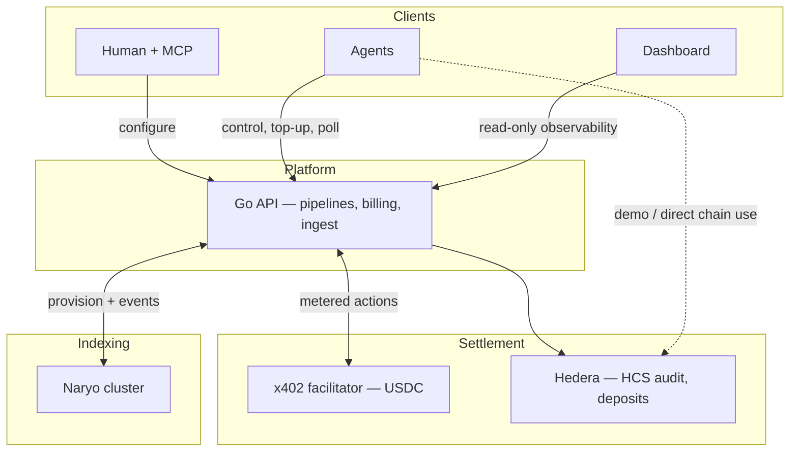
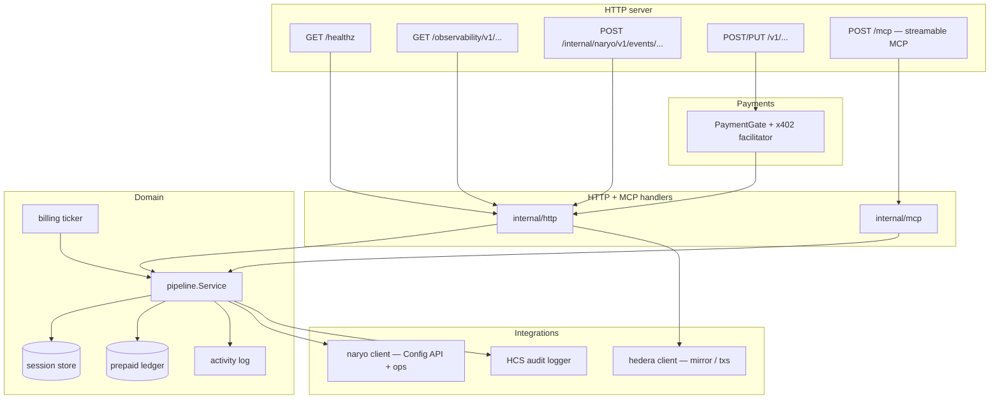

# french-hedera-ethglobal-cannes-2026

Metered control plane for agent-driven data pipelines: humans configure via MCP, agents pay per action with **x402** on the Go API; **Hedera** backs verification, audit, and HBAR flows where it adds value.

## Deployments
Audit topic: https://hashscan.io/testnet/topic/0.0.8511194/messages
Topic for test activity: https://hashscan.io/testnet/topic/0.0.8510924/messages

Agent wallet: https://sepolia.basescan.org/address/0xefd3c8d378aaa06c6c349f704680fc5d7c61a51d#tokentxns
Service wallet (receives payments): https://sepolia.basescan.org/address/0x091f2d318dd6c3c5a92553e7b36009e7e8519e50

USDC: https://sepolia.basescan.org/token/0x036cbd53842c5426634e7929541ec2318f3dcf7e

## Local deployment
Run dashboard:
`cd dashboard && npm i && npm run dev`
http://localhost:3000

(Optional) Run storybook
`cd dashboard && npm i && npm run storybook`
http://localhost:6006

Run API server (.env required)
`set -a && source cmd/api/.env && set +a && go run ./cmd/api`

Start Naryo cluster
`cd deploy/naryo-verify && docker compose up -d`

(Optional) Generate Hedera activity which we will can watch
`cd cmd/hcs-demo-activity && source .env && go run ./main.go -topic 0.0.8510924 -interval 10s`

(Optional) Run demo which subscribes to events watching our topic (.env required)
`cd agents/trading-signal && npm i && npm run demo`

## Architecture

### High level

Operators and agents share one **control plane API**. Paid pipeline actions go through **x402** (USDC on Base) into a **prepaid ledger**; **Naryo** runs indexing and delivery into the API; **Hedera** backs audit (HCS), deposit verification, and demos that move **HBAR** on-chain.

**How to read it:** **MCP** and **REST** hit the same pipeline model. **x402** gates the `/v1/...` surface; the **ledger** enforces prepaid time. **Naryo** is the data plane (filters, broadcasters); it posts events to the API, which can fan out to agents (see [`docs/PIPELINE_EVENT_ROUTING.md`](docs/PIPELINE_EVENT_ROUTING.md)). **Dashboard** proxies the unpaid observability routes on the API.

### Control plane (lower level)

Single **`cmd/api`** process: HTTP routes split between **x402-guarded** pipeline REST, **unpaid** health and observability, **webhook-authenticated** Naryo ingest, and **streamable MCP**. Domain logic lives in **`pipeline.Service`** with in-memory session state, prepaid ledger, periodic billing, and adapters to Naryo and Hedera/HCS.

**Dashboard (Next.js):** server routes under `dashboard/src/app/api/backend/*` call the API’s observability endpoints (`API_BASE_URL`, default `http://127.0.0.1:8080`).

For triggers, scope, and endpoint detail, see [`docs/PROJECT_SCOPE.md`](docs/PROJECT_SCOPE.md) and [`docs/RUNBOOK.md`](docs/RUNBOOK.md).
