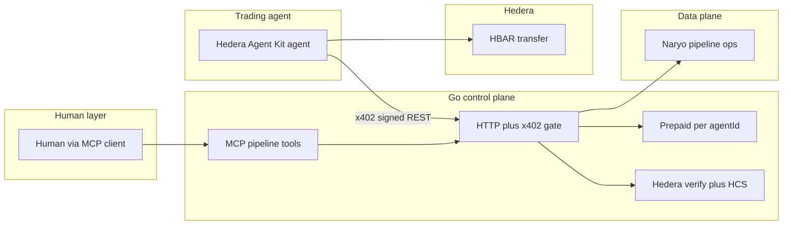

# Project scope

This document is the canonical boundary for the hackathon demo: what we are building, how the pieces connect, and what is intentionally out of scope.

## North star

We are building a **metered, payable control plane** for long-running **data pipelines** that **software agents** can drive. Humans and agents **pay per action** using **x402** (EVM “exact” scheme) on the Go API, with an **off-chain prepaid ledger** keyed by **`agentId`**. **Hedera** is used where it adds clear value (e.g. deposit verification, HCS audit / billing summaries)—not as a replacement for the MVP prepaid ledger.

**Naryo** is integrated via a **live Configuration API client** at runtime (required env); Go tests use an in-process **recording** client that does not call Naryo. The **payment and session model** stay real regardless.

## Demo story (judge path)

1. **Human** configures “what to watch” using an **MCP client** (e.g. IDE) against the Go **MCP** server, which updates pipeline configuration (session `eventSubscriptions` and related fields—the **narrative** is what matters).
2. **Trading / signal agent** uses **REST + x402** for paid control-plane actions and **Hedera Agent Kit** (or the Hedera SDK) for **HBAR** movements when logic decides to act.
3. **Prepaid / top-up:** the agent observes **`prepaidBalanceUnits`** (and related fields) from API status; when low, it calls **`topup/x402`** with an x402-aware client.
4. **Observability:** dashboard + summary API; optional HCS trail when configured.

## Architecture

## Triggers: polling only (v1)

The Go API **does not** push webhooks to the trading agent in v1.

- On a fixed interval, the agent calls **`GET /v1/pipelines/{id}/status`** and compares the response to a **previous snapshot** (e.g. `state`, `lastNaryoOpId`, `billedSeconds`, `autoPausedForFunds`, `prepaidBalanceUnits`).
- Optionally, a second poll uses **`GET /observability/v1/summary`** for a coarser “something changed” signal.

**Out of v1:** webhooks, SSE, stdin/file “fire,” and using MCP `get_pipeline_status` as the poll transport. **REST polling is intentional; push triggers are future work.**

## In scope (MVP / demo)

- x402-gated **pipeline control** and **top-up** routes on the Go API (see [`internal/http/middleware/x402.go`](../internal/http/middleware/x402.go)).
- **Unpaid** read paths needed for agents and dashboards, e.g. **`GET /v1/pipelines/{id}/status`** and **`GET /observability/v1/summary`** (see [RUNBOOK](./RUNBOOK.md)).
- **HBAR-only** on-chain actions for the agent narrative (transfers / treasury story)—no DEX routing or new Go smart contracts for this demo slice.
- **MCP** as the **human** setup path; **REST** as the **agent** control path.

## Out of scope (v1)

- **EVM swaps** or “native ETH” trading paths; x402 remains **EVM exact** on the control plane while **HBAR** is a separate Hedera path.
- **Parent → child prepaid transfer** APIs (orchestrator demos may use separate top-ups or dev auto-credit).
- **Production** hardening of unauthenticated observability endpoints (proxy / auth in real deployments).

## Agent package

The **trading-signal** agent scaffold lives under [`agents/trading-signal/`](../agents/trading-signal/). It includes an **x402-aware `fetch`** aligned with the Go server’s **PipelineRoutes** payment list and environment variables documented in `.env.example`.

## Operational links

- **[RUNBOOK](./RUNBOOK.md)** — run the Go API, dashboard, x402 env vars, prepaid behavior, and useful endpoints.
- **[NARYO_VERIFY.md](./NARYO_VERIFY.md)** — standalone Naryo Configuration API checks (optional).
